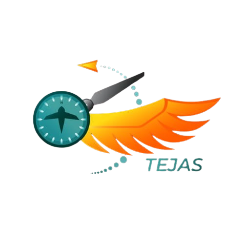

<div align="center">
  
  
  # 🚀 Team Tejas Official Website
  
  **Student-led aerospace innovation driven by precision, teamwork, and performance.**
  
  [](https://nextjs.org/)
  [](https://reactjs.org/)
  [](https://threejs.org/)
  [](https://greensock.com/)
  [](https://tailwindcss.com/)
</div>

<br />

## ✈️ About The Project

Welcome to the official repository for the **Team Tejas** website. Team Tejas is a premier student-led aerospace and aero-design collegiate team focused on building cutting-edge UAVs, remote-controlled aircraft, and competing in prestigious competitions like the **SAE Aero Design Challenge**.

This website serves as our digital headquarters—showcasing our engineering journey, our incredible team members, our technical milestones, and our rich history of taking flight.

## ✨ Key Features

- **Interactive 3D Hero Section:** Experience our CAD models directly in your browser using `Three.js` and custom GLTF models.
- **Cinematic Animations:** Smooth, scroll-driven storytelling powered by `GSAP` (GreenSock Animation Platform) and ScrollTrigger.
- **Dynamic Team Roster:** A sleek, fully responsive glass-morphism team directory that highlights our core, fabrication, design, avionics, and graphics members.
- **Milestones & Engineering:** A visual timeline of our engineering process, from CFD analysis to structural testing and final flight trials.
- **Media Gallery:** An immersive 3D horizontal carousel and masonry grid to showcase our candid moments and major highlights.

## 🛠 Tech Stack

- **Framework:** [Next.js (App Router)](https://nextjs.org/)
- **UI Library:** [React](https://reactjs.org/)
- **3D Rendering:** Vanilla `three.js` with GLTFLoader
- **Animations:** GSAP & ScrollTrigger
- **Styling:** CSS Modules & Tailwind CSS

## 🚀 Local Development

To get a local copy up and running, follow these simple steps:

### Prerequisites

- Node.js (v18 or higher recommended)
- npm, yarn, or pnpm

### Installation

1. Clone the repo
   ```bash
   git clone https://github.com/Shade555/TeamTejas_website.git
   ```
2. Navigate to the project directory
   ```bash
   cd TeamTejas_website/ts
   ```
3. Install dependencies
   ```bash
   npm install
   ```
4. Start the development server
   ```bash
   npm run dev
   ```
5. Open `http://localhost:3000` in your browser.

## 🤝 Contributing

Contributions are what make the open source community such an amazing place to learn, inspire, and create. Any contributions you make are **greatly appreciated**.

1. Fork the Project
2. Create your Feature Branch (`git checkout -b feature/AmazingFeature`)
3. Commit your Changes (`git commit -m 'Add some AmazingFeature'`)
4. Push to the Branch (`git push origin feature/AmazingFeature`)
5. Open a Pull Request

## 🏆 Achievements

* **SAE Aero Design Challenge:** Pushing the boundaries of autonomous and remote-controlled flight on a national stage.
* *More milestones to be added...*

---
<div align="center">
  <p>Built with ❤️ by the Team Tejas Webmasters.</p>
</div>
